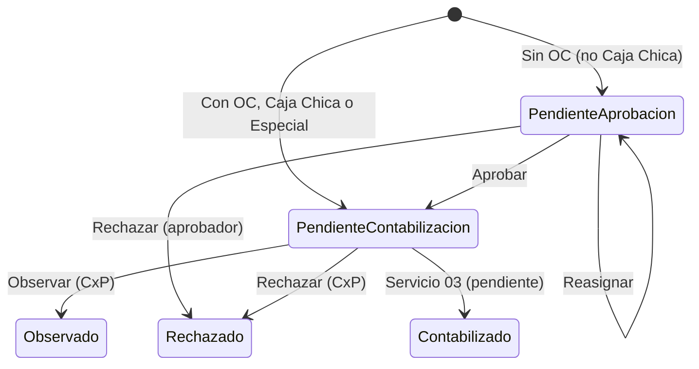

# Flujo actual del Portal de Proveedores

Describe cómo funciona hoy el sistema (front + backend). Lo marcado como **pendiente** aún no está implementado.

## Roles

| Rol | Código | Qué hace |
|---|---|---|
| Proveedor | `PROVIDER` | Registra sus propios documentos (Con OC / Sin OC) y consulta su estado. |
| Usuario interno | `INTERNAL_USER` | Registra documentos Sin OC (incluida Caja Chica) y documentos especiales. |
| Aprobador de área | `AREA_APPROVER` | Aprueba, rechaza o reasigna los documentos de su bandeja. |
| Cuentas por pagar | `ACCOUNTS_PAYABLE` | Contabiliza: rechaza u observa los documentos pendientes. |
| Administrador | `ADMINISTRATOR` | Ve todo, administra usuarios; puede actuar como cualquiera de los anteriores. |

## 1. Acceso

1. **Login** con RUC/usuario o correo y contraseña. JWT de sesión.
   - 5 intentos fallidos bloquean la cuenta 15 minutos (HTTP 429). Límite de 10 solicitudes por minuto por IP.
2. **Registro online** (proveedores): se valida el RUC contra SAP y se envía un enlace de activación al correo para crear la contraseña.
3. **Recuperar contraseña**: la respuesta es siempre genérica (no revela si el usuario existe); se envía un enlace por correo.
4. **Contraseña temporal**: los usuarios cargados por seed (o creados por el administrador) deben cambiarla en su primer ingreso (`/contrasena-temporal`). Mientras no lo hagan, el backend responde 403 `PASSWORD_CHANGE_REQUIRED` a todo lo demás.
5. Tras el login, cada rol llega a su pantalla de inicio.

## Sociedades por usuario

Cada usuario trabaja con una o varias sociedades (código SAP · razón social · RUC: 1001 Naviera Transoceánica S.A. · 20522163890; 1002 Petrolera Transoceánica S.A. · 20100126606; 1003 Naviera Petral S.A. · 20511922578; 1007 Representaciones Navieras y Aduaneras S.A.C. (RENADSA) · 20100245796). El administrador trabaja con todas.
- Registrar documentos solo ofrece las sociedades del usuario, y el aprobador elegido debe trabajar con la sociedad del documento.
- Las bandejas de Documentos y Contabilización solo muestran documentos de sus sociedades. Lo propio (registrado por él, emitido con su RUC o asignado a él como aprobador) siempre es visible.
- Los proveedores que se registran reciben todas las sociedades; el administrador puede restringirlas.
- Se asignan con el seed (`"companies"`; si se omite, todas) o desde Usuarios y roles.
- **Configuración › Sociedades**: el administrador crea, edita y activa/desactiva sociedades (código SAP, razón social, RUC y correo de facturación). El correo de la sociedad recibe copia de los avisos de rechazo y observación al proveedor.
- **Configuración › Áreas**: cada área pertenece a una sociedad (el nombre es único dentro de ella). Al registrar o reasignar solo se ofrecen las áreas de la sociedad del documento.

## 2. Registro de documentos

Pantalla **Registrar documentos**. Archivos requeridos para comprobantes electrónicos: **XML** (UBL 2.1), **PDF**, **CDR** (obligatorio salvo que la serie empiece con «E»), más sustentos PDF opcionales.

Validaciones comunes:
- El XML debe ser un comprobante UBL válido.
- Un proveedor solo registra documentos emitidos por su propio RUC.
- El receptor del XML debe coincidir con el RUC de la sociedad elegida (si la sociedad tiene RUC).
- No se permiten duplicados por (RUC, número).
- Se consulta SAP (servicio 01 y 02, hoy **simulados**) para validar duplicidad y, en comprobantes, SUNAT.

### 2.1 Con orden de compra
- Se indica tipo (Bien / Servicio) y número de orden; SAP debe devolverla con saldo disponible.
- **No pasa por aprobación**: queda en **Pendiente de contabilización**.

### 2.2 Sin orden de compra
- Se elige el área y el aprobador.
- Queda en **Pendiente de aprobación**.
- **Caja Chica** (casilla del formulario): solo personal interno o administrador, solo Sin OC. **Omite la aprobación** y queda en **Pendiente de contabilización**.

### 2.3 Documentos especiales
- Boleto aéreo, recibo público, no domiciliado y liquidación de cobranzas.
- Solo personal interno o administrador; se sube solo un PDF y se captura RUC, número, importe y moneda.
- Queda en **Pendiente de contabilización**. *(Pendiente de confirmar con negocio si deben pasar por aprobación.)*
- La liquidación de cobranzas se valida además en SUNAT.

## 3. Aprobación (Documentos)

El aprobador ve su bandeja (el administrador ve todas) y puede:
- **Aprobar**: debe indicar un N° de pedido o de viaje. Pasa a **Pendiente de contabilización**.
- **Rechazar**: con motivo obligatorio. Estado **Rechazado** (rechazado por aprobador). Se avisa al proveedor por correo.
- **Reasignar**: elige otro aprobador del área e indica el **motivo** (obligatorio). El documento sigue en Pendiente de aprobación con el nuevo aprobador.

## 4. Contabilización (Cuentas por pagar)

La bandeja muestra los documentos en **Pendiente de contabilización**. CxP puede:
- **Rechazar** con motivo → **Rechazado** (rechazado por contabilidad).
- **Observar** con motivo y correo → **Observado**; se notifica al proveedor para que corrija.

**Pendiente:** el estado **Contabilizado** (servicio 03, proceso diario con SAP) aún no se genera.

## 5. Estados

| Estado | Significado |
|---|---|
| Pendiente de aprobación | Espera la decisión del aprobador de área. |
| Aprobado | Existe en el modelo, pero al aprobar el documento pasa directo a Pendiente de contabilización. |
| Pendiente de contabilización | Espera a Cuentas por pagar. |
| Observado | CxP pidió una corrección. |
| Rechazado | Rechazado por el aprobador o por contabilidad. |
| Contabilizado | Reservado; aún no se genera. |

Cada acción queda en el **historial** del documento (quién, cuándo y la nota).

## 6. Otras pantallas

| Pantalla | Estado |
|---|---|
| Registrar documentos, Documentos, Contabilización | Conectadas al backend |
| Usuarios y roles (administración) | Conectada al backend: crear, editar (roles, área, sociedades), activar/desactivar y desbloquear |
| Orden de pago, Estado de factura | Conectadas a SAP en línea (zconsopago y zconsfactu). Proveedor: su RUC; CxP y administrador: ingresan el RUC |
| Sociedades, Áreas | Conectadas al backend (crear, editar, activar/desactivar) |
| Roles y permisos, Menús, Workflows | En preparación |

## 7. Integraciones

| Integración | Estado |
|---|---|
| SAP servicio 01 (validar orden) y 02 (duplicidad) | Simulados (`MockSapDocumentGateway`) |
| SAP servicio 03 (contabilizado) | Pendiente |
| SUNAT | A través de SAP; simulado |
| Correo SMTP | Activación, recuperación y avisos de rechazo / observación |
| Almacenamiento de adjuntos | Disco local del servidor |
