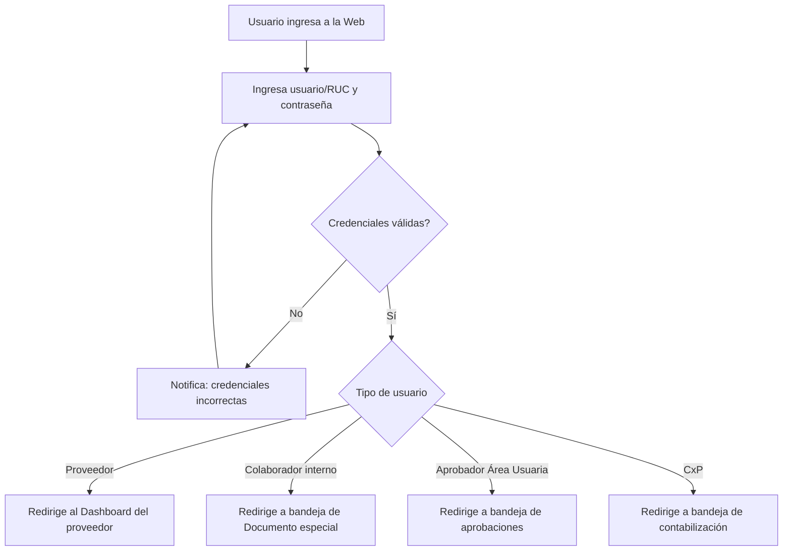
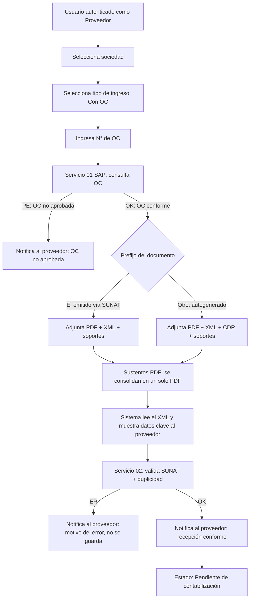
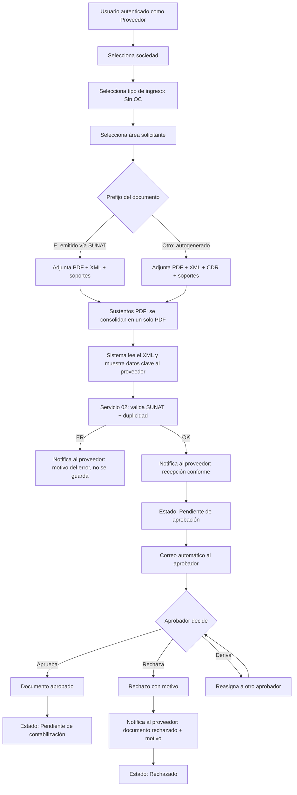
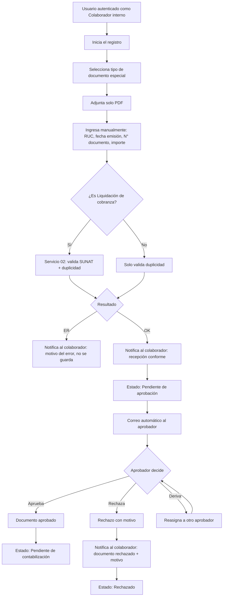
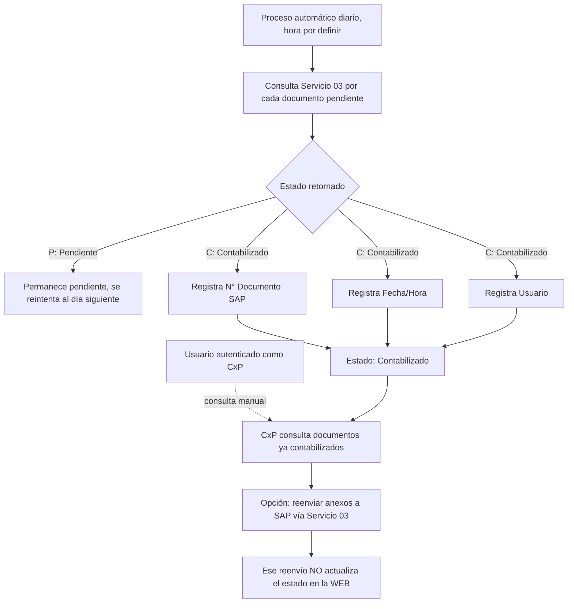
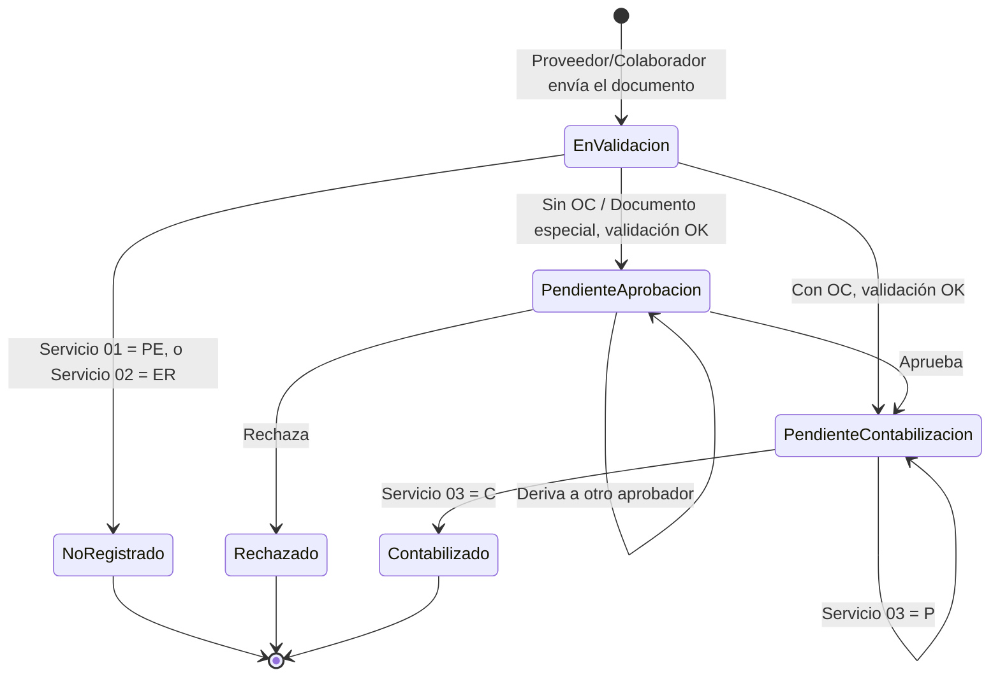

# Flujo del Sistema Web de Proveedores

## Resumen

El sistema permite a los proveedores de la naviera registrar sus documentos de cobro (facturas, boletas, y otros comprobantes) de forma digital, ya sea que tengan o no una orden de compra asociada. Según el tipo de documento, el sistema valida automáticamente contra SUNAT y SAP, y si corresponde, lo envía a un aprobador interno antes de que quede listo para su contabilización. Un proceso interno adicional permite al personal de la naviera registrar documentos especiales (boletos aéreos, recibos públicos, entre otros) que no gestiona el proveedor directamente. Finalmente, un proceso automático diario contabiliza los documentos aprobados directamente contra SAP.

## Roles que participan

| Rol | Qué hace en el sistema |
| --- | --- |
| **Proveedor** | Registra sus documentos de cobro (con o sin orden de compra) y consulta su estado. |
| **Colaborador interno** | Registra documentos especiales (boletos aéreos, recibos públicos, etc.) en nombre de la naviera. |
| **Aprobador (Área Usuaria)** | Revisa y aprueba, rechaza o deriva los documentos que lo requieren. |
| **CxP (Cuentas por Pagar)** | Consulta los documentos ya contabilizados y puede reenviar sus anexos a SAP. |

Este documento describe, paso a paso, qué hace el sistema en cada acción, qué mensajes recibe el usuario, y en qué estado queda el documento en cada momento.

---

## 0. Inicio de sesión (aplica a todos los flujos)

**Paso a paso:**

1. **El usuario ingresa sus credenciales** (usuario/RUC y contraseña) en la pantalla de login. Incluye opción de "Olvidé mi contraseña".
2. **El sistema valida las credenciales.**
   - Si son incorrectas, se muestra un mensaje de error y el usuario puede reintentar.
   - Si son correctas, el sistema identifica el tipo de usuario y lo redirige a la pantalla correspondiente: Dashboard del proveedor, bandeja de registro de Documento especial (colaborador), bandeja de aprobaciones (Área Usuaria), o bandeja de contabilización (CxP).
3. Todo lo que sigue en las secciones 1 a 4 de este documento **ocurre ya con el usuario autenticado** y con su rol identificado por el sistema.

---

## 1. Registro — Comprobante CON Orden de Compra

**Paso a paso:**

1. **El proveedor selecciona la sociedad receptora** del documento: 1001 Naviera, 1002 Ultratag, 1003 Petral o 1007 RENADSA.
2. **Selecciona el tipo de ingreso: "Con Orden de Compra"** e ingresa el número de OC correspondiente.
3. **El sistema consulta el Servicio 01 de SAP**, enviando la sociedad y el número de OC.
   - Si SAP responde **PE** (OC no aprobada), el sistema detiene el proceso y notifica al proveedor.
   - Si SAP responde **OK**, el proveedor avanza al siguiente paso.
4. **El proveedor adjunta los archivos del comprobante.** Los archivos que se piden dependen del prefijo del número de documento en el XML:
   - **Prefijo "E" (documento emitido a través de SUNAT):** se piden **PDF + XML**, más los documentos de sustento adicionales. El CDR no aplica en este caso.
   - **Cualquier otro prefijo (documento autogenerado por el contribuyente):** se piden **PDF + XML + CDR** (la Constancia de Recepción que emite SUNAT al validar el comprobante), más los documentos de sustento.
   - En ambos casos, los documentos de sustento en **PDF** se guardan tal cual y además se genera un **PDF consolidado** (comprobante + sustentos) que se usa en los siguientes pasos; los sustentos en **otros formatos** (Excel, Word, etc.) solo se archivan, sin generar consolidado.
5. **El sistema lee el XML y muestra un resumen** al proveedor antes de confirmar el envío: empresa emisora, moneda, importes, descripción del bien o servicio, y otros datos relevantes.
6. **Al confirmar, se consulta el Servicio 02** (SUNAT + duplicidad), enviando RUC, fecha de emisión, número de documento SUNAT e importe.
   - **ER**: se notifica al proveedor con el motivo específico (no conforme en SUNAT o duplicado). No se guarda nada en base de datos ni repositorio.
   - **OK**: se notifica al proveedor la recepción conforme.
7. **El documento queda en Estado Pendiente de contabilización**, con todos sus archivos y datos ya almacenados.

---

## 2. Registro — Comprobante SIN Orden de Compra

**Paso a paso:**

1. **El proveedor selecciona la sociedad receptora.**
2. **Selecciona el tipo de ingreso: "Sin Orden de Compra"** y elige el área solicitante dentro de la naviera.
3. **Adjunta los archivos**, según el mismo criterio de prefijo del flujo con OC: si el documento tiene prefijo "E" (SUNAT), se piden PDF + XML
   - soportes (sin CDR); si tiene otro prefijo, se piden PDF + XML + CDR
   - soportes. Los sustentos en PDF se consolidan automáticamente; otros formatos solo se archivan.
4. **El sistema lee el XML y muestra el resumen** de datos clave.
5. **Al confirmar, se consulta el Servicio 02** (SUNAT + duplicidad).
   - **ER**: se notifica al proveedor con el motivo, no se guarda nada.
   - **OK**: se notifica al proveedor la recepción conforme.
6. **El documento queda en Estado Pendiente de aprobación**, y el sistema **envía automáticamente un correo al aprobador** asignado.
7. **El aprobador toma una de tres acciones:**
   - **Aprobar**: el documento pasa a "Pendiente de contabilización".
   - **Rechazar**, indicando un motivo obligatorio. El sistema notifica al proveedor con el motivo del rechazo.
   - **Derivar**: se reasigna a otro aprobador, quien vuelve a tener las mismas tres opciones — el ciclo se repite hasta que alguien apruebe o rechace.

---

## 3. Documento especial — proceso INTERNO (no lo hace el proveedor)

**Importante:** este proceso **no lo ejecuta el proveedor** — lo inicia un colaborador interno de la naviera, y no debe estar disponible en el portal externo de proveedores. Todas las notificaciones de este flujo van al colaborador, no al proveedor.

**Paso a paso:**

1. **Un colaborador interno inicia el registro** y selecciona el subtipo: Boleto aéreo, Recibo público, No domiciliado, o Liquidación de cobranza.
2. **Adjunta únicamente el PDF** del documento (no se piden XML ni CDR).
3. **Ingresa manualmente los datos**: RUC del proveedor, fecha de emisión, número de documento SUNAT, e importe.
4. **El sistema valida según el subtipo**:
   - **Liquidación de cobranza**: consulta el Servicio 02 completo (SUNAT + duplicidad).
   - **Los otros tres subtipos**: solo se valida duplicidad, sin consulta a SUNAT.
5. **Según el resultado:**
   - **ER**: se notifica al colaborador con el motivo, no se guarda nada.
   - **OK**: se notifica al colaborador la recepción conforme, el documento queda en **Estado Pendiente de aprobación**, se guarda en base de datos y repositorio (si aplica), y se envía correo automático al aprobador.
6. **El aprobador toma la misma decisión de tres vías que en el flujo Sin OC** — el documento de lineamientos confirma que este workflow de aprobación es compartido entre ambos flujos:
   - **Aprobar**: pasa a "Pendiente de contabilización".
   - **Rechazar** con motivo: se notifica al colaborador con el motivo.
   - **Derivar**: se reasigna a otro aprobador y el ciclo se repite.

---

## 4. Contabilización

**Paso a paso:**

1. **Un proceso automático corre una vez al día** (hora por definir) y recorre todos los documentos en estado "Pendiente de contabilización", sin importar si vinieron del flujo Con OC, Sin OC o Documento especial.
2. **Por cada documento, se consulta el Servicio 03**, enviando RUC, fecha de emisión, número de documento SUNAT, importe, y el link a los documentos anexos.
3. **El servicio retorna uno de dos estados:**
   - **"P" (Pendiente)**: no se hace nada más, se reintenta al día siguiente.
   - **"C" (Contabilizado)**: se guardan el número de documento contable SAP, la fecha/hora, y el usuario que lo contabilizó. El documento pasa a estado **Contabilizado**.
4. **CxP puede consultar los documentos ya contabilizados**, con opción de **reenviar los anexos** hacia SAP vía el mismo Servicio 03. Este reenvío es solo de salida: su respuesta no actualiza nada en la web.

---

## Estados del documento

### Estados persistidos (el documento ya está guardado en el sistema)

| Estado | Aplica a | Se alcanza cuando... | Siguiente paso |
| --- | --- | --- | --- |
| Pendiente de contabilización | Con OC, Sin OC, Documento especial | Con OC: el Servicio 02 valida SUNAT y duplicidad con éxito. Sin OC / Documento especial: el aprobador aprueba el documento | El proceso batch diario de contabilización lo recoge (Servicio 03) |
| Pendiente de aprobación | Sin OC, Documento especial | El Servicio 02 valida SUNAT y duplicidad con éxito | El aprobador decide: Aprobar / Rechazar / Derivar |
| Rechazado | Sin OC, Documento especial | El aprobador rechaza el documento, indicando un motivo | Estado final — se notifica al proveedor o al colaborador |
| Contabilizado | Con OC, Sin OC, Documento especial | El Servicio 03 retorna "C" | Estado final — queda registrado con N° Documento SAP, Fecha/Hora y Usuario |

### Resultados sin persistencia (el documento nunca llega a guardarse)

| Resultado | Aplica a | Motivo |
| --- | --- | --- |
| OC no aprobada (PE) | Con OC | El Servicio 01 indica que la orden de compra no está aprobada en SAP |
| Documento no conforme o duplicado (ER) | Con OC, Sin OC, Documento especial | El Servicio 02 rechaza el documento por SUNAT o por duplicidad |

A diferencia de "Rechazado" (que sí queda guardado, con historial y notificación), estos dos casos nunca llegan a crear un registro — el proveedor o colaborador simplemente ve el mensaje de error y debe volver a intentar el envío desde cero.

---

## Anexo técnico

Esta sección reúne información de referencia para el equipo técnico — no es necesaria para entender qué hace el sistema desde el punto de vista del usuario, pero documenta el detalle de integración.

### Servicios SAP identificados

| Servicio | Función | Envía | Retorna |
| --- | --- | --- | --- |
| Servicio 01 | Consulta de OC | Sociedad, N° OC | OK / PE |
| Servicio 02 | Consulta SUNAT + duplicidad | RUC, fecha emisión, N° documento SUNAT, importe | OK / ER |
| Servicio 03 | Estado de contabilización (batch diario) | RUC, fecha emisión, N° documento SUNAT, importe, link de anexos | Estado C/P + (si C) Documento_SAP, Fecha/Hora, Usuario |

### Ciclo de vida del documento (vista técnica unificada)

Este diagrama resume el recorrido completo de un documento sin importar por cuál de los tres flujos haya entrado: la diferencia entre Con OC y Sin OC/Documento especial está únicamente en si pasa o no por "Pendiente de aprobación" antes de llegar a "Pendiente de contabilización".